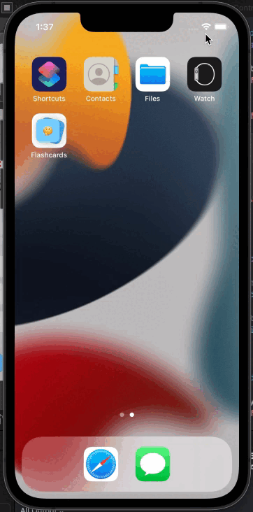

## Flashcard App

## Lab 4

### App Description
Spruced up my Flashcard app with animation and styles including an app icon, a splash screen, flip and slide animations, and a pop up animation once the app loads. Also got the multiple choice questions to store in the app and animate alongside the card. 

### App Walk-through

GIF URL: https://imgur.com/a/S5Zgeal

## Required
- [X] User should see the app icon 
- [X] User should see a splash screen
- [X] User should see an flip animation when revealing the answer
- [X] User should see a slide animation when going to the next flashcard
- [X] User should see a slide animation when going to the previous flashcard
- [X] Push code to GitHub
## Optional
- [X] User should see a nicer flaschard with rounded corners, shadows, and animating when showing the first time
- [X] User should see all views properly layout when using the app on a phone of different sizes
- [X] Correct answer in multiple choice should be random

## Lab 3

### App Description
Created next and previous buttons to allow user to scroll through flashcards. Stored flashcards in an array allowing users to re-open the app and see saved flashcards. Also created a delete flashcard function which would remove the card from the array. 

### App Walk-through

GIF URL: https://imgur.com/a/j3sfkdI

## Required
- [X] User can browse through multiple flashcards
- [X] User can re-open the app and see previously created flashcards
- [X] Push code to GitHub
## Optional
- [X] User can delete a flashcard
- [X] User can edit existing flashcard
- [X] User can store multiple choice questions

## Lab 2

### App Description
Created an additional screen on the flashcard app which allows users to change the questions and answers presented on the flashcard. Users are also able to edit the question or answer on the flashcard by tapping the "pencil" icon on the card to edit. 

### App Walk-through

GIF URL: https://imgur.com/a/oZ1s4tz

## Required
- [X] User can open the creation screen
- [X] User can cancel out of the creation screen
- [X] User can enter a new question and answer in the creation screen to then show it on the flashcard
- [X] Push code to GitHub
## Optional
- [X] User gets an error if they try to create a new flashcard with no question or answer
- [X] User can edit existing flashcard
- [X] User can add multiple choice answers in the creation screen

## Lab 1

### App Description
Created a basic flashcard app with a question in the front and the answer in the back revealable by a tap on the card. I added multiple choices for the user to guess the answer. Upon clicking the right answer, the answer is revealed on the card as well. Also added some design such as a background image in the app and the card, and styled the cards to better distinguish between the question and answer sides. 

### App Walk-through

GIF URL: https://imgur.com/a/UDZoPUr

## Required
- [x] Create New Project in Xcode
- [x] Add a view for the front side of the flashcard to display the question
- [x] Add a view for the back side of the flashcard to display the answer
- [x] Build in logic to show the answer side when the card is tapped
- [x] Push code to GitHub
## Optional
- [x] Toggle the flashcard between the question side and the answer side
- [x] Style the question and answer side of the card to better distinguish between the two sides
- [x] Add selectable multiple choice answers beneath the card

Sources:

Show/Hide Image in Swift: https://stackoverflow.com/questions/37569037/show-hide-image-in-swift/50921916
    for frontLabel.isHidden = !frontLabel.isHidden

Background Image: 
https://unsplash.com/photos/EWDvHNNfUmQ

Card Image:
https://unsplash.com/photos/KcsKWw77Ovw
